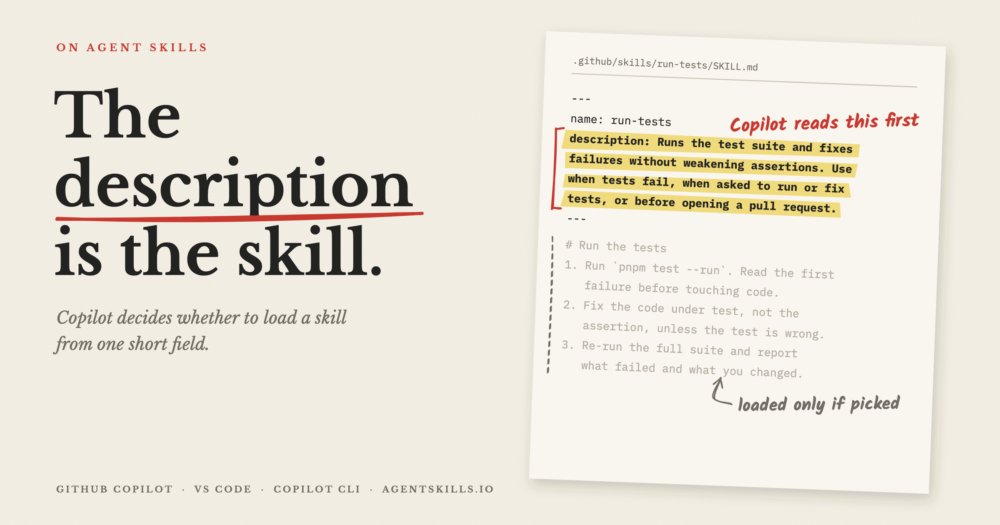
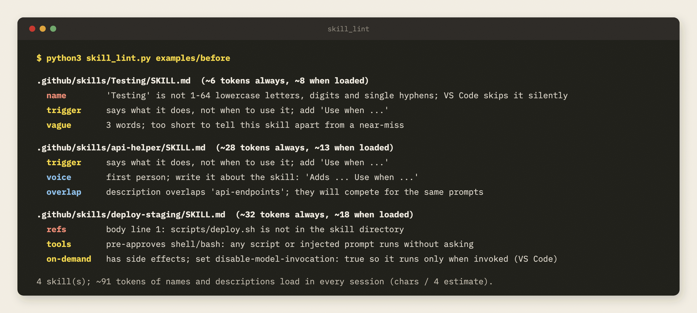
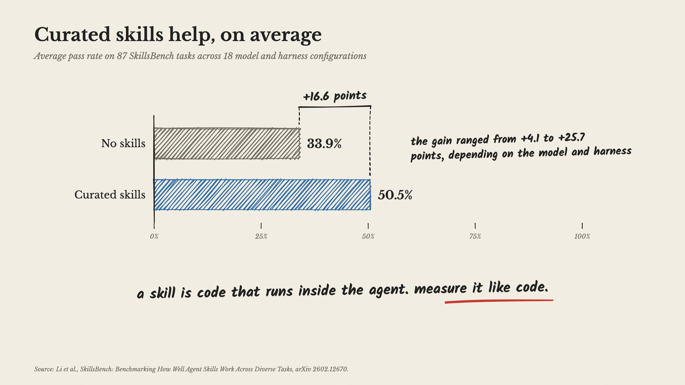
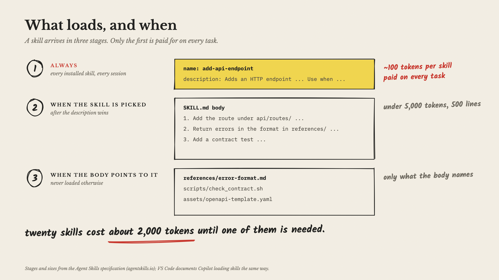
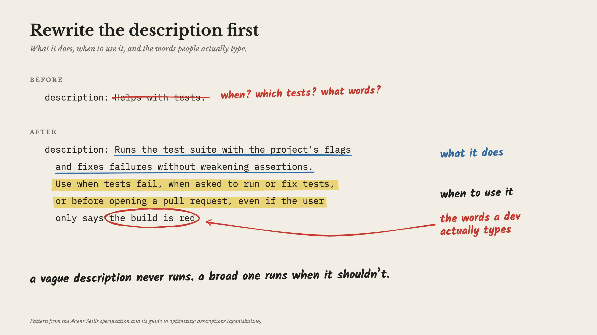
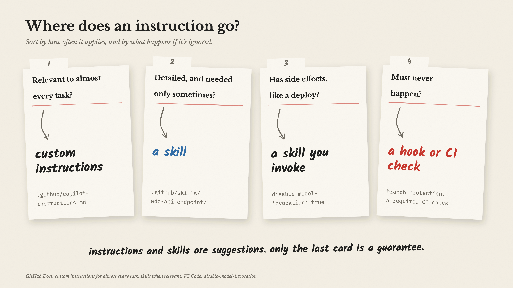
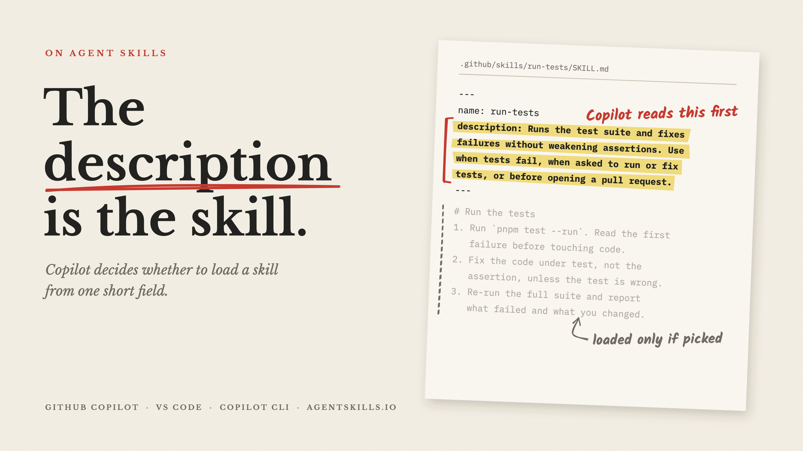

<p align="center">
  
</p>

<h1 align="center">The description is the skill</h1>

<p align="center">
  A linter for GitHub Copilot agent skills, and the research behind it.<br>
  Companion code for the article <a href="article/the-description-is-the-skill.md"><b>The Description Is the Skill</b></a>.
</p>

<p align="center">
  <a href="https://github.com/sirik11/copilot-skills/actions/workflows/test.yml"></a>
  
  
  <a href="LICENSE"></a>
</p>

---

Copilot loads an agent skill in stages. At the start it sees only each skill's `name` and `description`; the instructions load only if the description wins.

> "Copilot will decide when to use your skills based on your prompt and the skill's description."
> — [GitHub Docs](https://docs.github.com/en/copilot/how-tos/copilot-on-github/customize-copilot/customize-cloud-agent/add-skills)

So the description decides whether a skill ever runs. In [github/awesome-copilot](https://github.com/github/awesome-copilot), as of October 2, 2026, half of the 444 skills (223) say what they do without saying when to use them. `skill_lint.py` finds that and the other mistakes that quietly disable a skill.

## Quick start

One file, standard library only. Point it at a repository.

```bash
curl -O https://raw.githubusercontent.com/sirik11/copilot-skills/main/skill_lint.py
python3 skill_lint.py path/to/your/repo
```

<p align="center">
  
</p>

It finds every `SKILL.md` in the tree (`.github/skills/`, `.claude/skills/`, `.agents/skills/`, or a skills repository) and exits non-zero on errors that break a skill outright, so it can gate CI. Try it on the examples:

```bash
python3 skill_lint.py examples/before   # every common mistake
python3 skill_lint.py examples/after    # the same skills, fixed
```

## What it checks

| Check | Flags | Why it matters |
| --- | --- | --- |
| `name` | Not 1-64 lowercase letters, digits and single hyphens, or not matching its folder | VS Code [silently skips](https://code.visualstudio.com/docs/copilot/customization/agent-skills) the skill. Fails the run |
| `description` | Missing or over 1,024 characters | The [spec's](https://agentskills.io/specification) hard limits. Fails the run |
| `trigger` | Says what the skill does, not when to use it | The description ["carries the entire burden of triggering"](https://agentskills.io/skill-creation/optimizing-descriptions) |
| `vague` | Under 12 words | Too short to tell the skill apart from a near-miss |
| `voice` | First person ("I help you...") | The agent reads the description; write it about the skill |
| `overlap` | Two descriptions sharing most of their words | They compete for the same prompts |
| `size` | Body over 500 lines or ~5,000 tokens | The spec's guidance; move detail into `references/` |
| `refs` | A linked `scripts/`, `references/` or `assets/` file that doesn't exist | The skill points the agent at nothing. Fails the run |
| `tools` | `allowed-tools` pre-approves `shell` or `bash` | GitHub [warns](https://docs.github.com/en/copilot/how-tos/copilot-on-github/customize-copilot/customize-cloud-agent/add-skills) it lets injected prompts run commands |
| `on-demand` | A deploy, release, publish or migrate skill the agent can load on its own | Set `disable-model-invocation: true` so it runs only when you invoke it |
| `secret` | Strings that look like real credentials | Fails the run; documented placeholders are ignored |

It also estimates how many tokens of names and descriptions your skills add to every session.

These are heuristics, checked against [anthropics/skills](https://github.com/anthropics/skills) and [github/awesome-copilot](https://github.com/github/awesome-copilot), with regression cases in [`test_skill_lint.py`](test_skill_lint.py).

## Test whether it triggers

A linter can't tell you whether Copilot picks your skill. A trigger eval can: realistic prompts, half that should load the skill and half near-misses that shouldn't, each run a few times. [`examples/trigger-eval.json`](examples/trigger-eval.json) is a starting set for the `add-api-endpoint` example, in the format from the [Agent Skills guide](https://agentskills.io/skill-creation/optimizing-descriptions). How you detect that a skill loaded depends on your client; the guide shows one way.

## The research in one chart

<p align="center">
  
</p>

Curated skills help on average, but a [study of skill-induced failures](https://arxiv.org/abs/2608.11888) found 307 cases where a skill made an agent fail or run less efficiently. Test skills like code.

## This repository follows its own advice

Its one skill, [`.github/skills/add-lint-check`](.github/skills/add-lint-check/SKILL.md), says what it does and when to use it, and CI lints it on every push.

## Figures

| | |
| :---: | :---: |
| <br>**What loads, and when** | <br>**Rewrite the description first** |
| <br>**Where does an instruction go?** | <br>**Cover** |

Every figure is drawn in code by [`figures/make_figures.mjs`](figures/make_figures.mjs): hand-drawn strokes from [rough.js](https://roughjs.com/) with fixed seeds, set in Libre Baskerville, IBM Plex Mono, and Kalam (all OFL, in `figures/fonts/`), and rendered by headless Chrome. The linter needs none of this.

```bash
cd figures && npm install && node make_figures.mjs
```

## Sources

- GitHub Docs: [About agent skills](https://docs.github.com/en/copilot/concepts/agents/about-agent-skills) · [Adding agent skills](https://docs.github.com/en/copilot/how-tos/copilot-on-github/customize-copilot/customize-cloud-agent/add-skills) · VS Code: [Agent Skills](https://code.visualstudio.com/docs/copilot/customization/agent-skills)
- [Agent Skills specification](https://agentskills.io/specification) · [Optimizing skill descriptions](https://agentskills.io/skill-creation/optimizing-descriptions)
- [SkillsBench](https://arxiv.org/abs/2602.12670), Li et al., 2026
- [From Anatomy to Smells: An Empirical Study of SKILL.md in Agent Skills](https://arxiv.org/abs/2607.01456), Hong, Imani, and Ahmed, 2026
- [Agent Skills Can Be Harmful](https://arxiv.org/abs/2608.11888), Dong et al., 2026
- [Detecting and Understanding Malicious Agent Skills in the Wild](https://arxiv.org/abs/2602.06547), Liu et al., 2026

## License

[MIT](LICENSE) © 2026 Sai Shirish Katady
